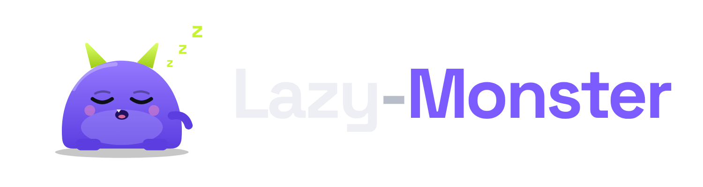
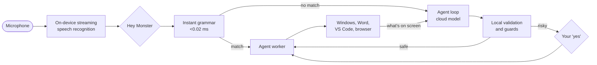

<p align="center">
  <picture>
    <source media="(prefers-color-scheme: dark)" srcset="docs/assets/brand/logo-dark.png">
    <source media="(prefers-color-scheme: light)" srcset="docs/assets/brand/logo-light.png">
    
  </picture>
</p>

<h3 align="center">Say it. The monster does it.</h3>

<p align="center">
  A local-first voice agent for Windows that opens apps, writes documents and handles the busywork,<br>
  so you can stay exactly as lazy as you deserve to be.
</p>

<p align="center">
  <a href="LICENSE"></a>
  
  
  
</p>

---

## What it does

<table>
<tr>
<td width="50%" valign="top">
&nbsp;<b>Instant commands</b><br>
"Hey Monster, mute." Volume, media, windows, apps and settings run on-device in milliseconds, often before you finish the sentence. No network, no cost.
</td>
<td width="50%" valign="top">
&nbsp;<b>Real work, not just chat</b><br>
"Hey Monster, open VS Code and write a snake game in Python." The agent drives real apps step by step while you watch: Word, VS Code, your browser and more.
</td>
</tr>
<tr>
<td valign="top">
&nbsp;<b>Talks back, locally</b><br>
A natural open-source voice (Kokoro) that says what it did, offers the next step, and asks when it is unsure.
</td>
<td valign="top">
&nbsp;<b>Safe by construction</b><br>
The model proposes and Lazy-Monster checks. There is no shell tool, no delete and no send. Files stay in a sandbox folder, and risky steps wait for your "yes".
</td>
</tr>
<tr>
<td valign="top">
&nbsp;<b>Local-first, NPU ready</b><br>
Wake word, speech recognition and instant commands never leave your PC. OpenVINO detects the Intel NPU so on-device models can run there. Only open-ended tasks reach a cloud model.
</td>
<td valign="top">
&nbsp;<b>Bring your own brain</b><br>
OpenAI today. Any OpenAI-compatible endpoint works, and more providers plug in behind one typed interface.
</td>
</tr>
</table>

## How it works



Three lanes, one rule: **every action is a typed tool declared in [`lazymonster/intents.py`](lazymonster/intents.py)**. Anything else is rejected, whoever asked for it.

## Install

One command in PowerShell (Windows 10 or 11, no admin rights):

```powershell
irm https://raw.githubusercontent.com/AndySync-09/lazy-monster/main/install.ps1 | iex
```

First it sets up the brain: **OpenAI**, **Claude**, or a **local model** (Ollama, llama.cpp, vLLM, LM Studio), and checks it works. Optionally it adds **Jev** by TypeSafe, which makes the fast decisions around the brain (was that meant for me, which tool, did you say yes). Then it finds or installs Python, installs Lazy-Monster in its own folder, downloads the voice models, learns your voice, and starts it in the background.

Make it yours (voices, your own speech and voice models, the brain): see [docs/VOICES.md](docs/VOICES.md). Run it again to update. Prefer to read it first? See [install.ps1](install.ps1). To remove: `uninstall.ps1` in `%LOCALAPPDATA%\LazyMonster\app`.

macOS is coming next week. Watch the repo (Watch → Custom → Releases) to hear when it ships.

Developers: clone the repo and run `powershell -ExecutionPolicy Bypass -File .\setup.ps1` for an editable install.

Website: [andysync-09.github.io/lazy-monster](https://andysync-09.github.io/lazy-monster/) (served from `docs/`).

## Local by default

| Part | Model | Runs on |
|---|---|---|
| "Hey Monster" wake word | Your personal detector on openWakeWord features | Intel NPU |
| Instant commands | Moonshine small (streaming, only after the wake word) | CPU |
| What the agent hears | distil-Whisper large-v3, INT8, via OpenVINO GenAI | Intel NPU (GPU/CPU fallback) |
| The monster's voice | Kokoro-82M, voice `af_heart` | CPU |
| The agent's reasoning | gpt-5.4-mini (configurable, any OpenAI-compatible endpoint) | cloud |

Prepare the local models once (about 1.9 GB download, then compiled for your NPU):
```powershell
.\.venv\Scripts\monster.exe models
```

Train your personal "Hey Monster" wake word (about 3 minutes, runs on the NPU afterwards):
```powershell
.\.venv\Scripts\monster.exe wake-train
```

## Make it yours

Lock it to your voice (read five sentences):
```powershell
.\.venv\Scripts\monster.exe voice-enroll
```
Push-to-talk from anywhere: **Ctrl+Alt+Space**. "Hey Monster, sleep" shrinks it to a small orb that keeps listening.

## Run it in the background

Start Lazy-Monster at sign-in, hidden until you say "Hey Monster":
```powershell
.\.venv\Scripts\monster.exe service install
```
Check it, or stop it:
```powershell
.\.venv\Scripts\monster.exe service status
```
```powershell
.\.venv\Scripts\monster.exe service uninstall
```

## Commands

| Command | What it does |
|---|---|
| `monster` (or `monster ui`) | The Lazy-Monster window: particle monster, transcript, steps, text box |
| `monster run [-v] [--dry-run]` | Headless: listen on the microphone in the terminal |
| `monster models` | Download and prepare the local speech and voice models |
| `monster wake-train` | Train your personal "Hey Monster" wake word |
| `monster text [--execute]` | Type requests instead of speaking |
| `monster do <task>` | Run one task with the agent and watch each step (`--dry-run` to simulate) |
| `monster npu` | Detect and benchmark the NPU, GPU and CPU via OpenVINO |
| `monster doctor` | Check the environment, microphone, key and Word |
| `monster apps` | List every app the monster can open |
| `monster record <dir>` then `monster bench-audio <dir>` | Measure accuracy and time-to-action on your own voice |

## Things you can say

| Instant (local) | Agent (planner) |
|---|---|
| "Hey Monster, set volume to 30" | "Hey Monster, open Word and write a cover letter for a design job and save it" |
| "Hey Monster, next song" | "Hey Monster, write a packing list for Bangkok and save it as a text file" |
| "Hey Monster, open Bluetooth settings" | "Hey Monster, draft a birthday poem for my sister in Word" |
| "Hey Monster, lock the computer" | "Hey Monster, open VS Code and write a snake game in Python" |
| "Hey Monster, stop" (cancels a running task), "Hey Monster, sleep" (exits) | "Hey Monster, open Notepad and write my grocery list" |

## Roadmap

See [docs/SPEC.md](docs/SPEC.md). In short: floating orb UI, realtime conversational voice, accent adaptation, a one-click installer, then Excel and PowerPoint.

## Contributing

Pull requests are welcome. Read [CONTRIBUTING.md](CONTRIBUTING.md) first. Every new ability must be a typed tool with tests, and nothing may weaken the safety rules in [SECURITY.md](SECURITY.md).

## License

[Apache 2.0](LICENSE). The monster is lazy, not proprietary.
