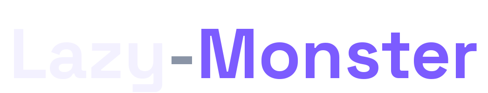

<p align="center">
  <br>
  <picture>
    <source media="(prefers-color-scheme: dark)" srcset="docs/assets/brand/wordmark-dark.png">
    <source media="(prefers-color-scheme: light)" srcset="docs/assets/brand/wordmark-light.png">
    
  </picture>
</p>

<h3 align="center">Say it. The monster does it.</h3>

<p align="center">
  A voice agent that lives on your Windows AI PC. It hears you on the NPU, thinks on the GPU,<br>
  talks on the CPU, drives your real apps, and keeps working when the Wi-Fi dies.
</p>

<p align="center">
  <a href="LICENSE"></a>
  
  
  
  
</p>

<p align="center">
  <a href="#install"><b>Install in one line</b></a> &nbsp;·&nbsp;
  <a href="#three-engines-one-monster"><b>How it thinks</b></a> &nbsp;·&nbsp;
  <a href="#brain-break"><b>Brain-Break</b></a> &nbsp;·&nbsp;
  <a href="#models-that-ship"><b>Models</b></a> &nbsp;·&nbsp;
  <a href="https://lazymonster.space"><b>lazymonster.space</b></a>
</p>

<!-- Demo video: drag docs/media/lazy-monster-16x9.mp4 into this README in GitHub's editor and paste the
     https://github.com/user-attachments/... link it gives you on the line below; GitHub then plays it inline. -->

---

## You say "Hey Monster". Then:

<table>
<tr>
<td width="50%" valign="top">&nbsp;<b>Simple stuff in 0.3 s, on your PC</b><br>
"Open Spotify." "Volume 40." "Remind me in 20 minutes to stretch." A small model on your GPU picks the action in about 0.3 seconds. No cloud, no cost, no waiting.</td>
<td width="50%" valign="top">&nbsp;<b>Real work in real apps</b><br>
"Open VS Code and write a snake game." "Make three slides about Meta AI." "Write my cover letter in Word and save it." It drives the actual apps, step by step, while you watch.</td>
</tr>
<tr>
<td valign="top">&nbsp;<b>Brain-Break: works offline</b><br>
Wi-Fi gone? It says so, switches to its on-PC brain and keeps going. Anything that truly needs the internet waits, and it offers it again when you're back.</td>
<td valign="top">&nbsp;<b>Sees your screen, when you ask</b><br>
"Explain this error." It reads the window, and reads text out of screenshots on the NPU. Screenshots never leave your PC unless you allow it.</td>
</tr>
<tr>
<td valign="top">&nbsp;<b>Comes to you</b><br>
"Remind me about the cafe meeting at 8 AM." At 8 it wakes up, tells you, and suggests what to do next: open the project, update the code, draft the email. It always asks first.</td>
<td valign="top">&nbsp;<b>Only your voice</b><br>
Voice lock ignores the TV and the room. Talk over it to interrupt; its own voice can't. Push-to-talk from anywhere: <kbd>Ctrl</kbd>+<kbd>Alt</kbd>+<kbd>Space</kbd>.</td>
</tr>
</table>

## Three engines, one monster

<p align="center"></p>

An Intel AI PC has three different processors. Lazy-Monster gives each one the job it's best at, so the always-on parts sip power and the fast parts are fast. Measured on a Core Ultra 9 185H laptop:

| | Engine | Job | Measured |
|---|---|---|---|
|  | **NPU** | "Hey Monster" wake word, always listening | about 2% NPU load |
|  | **NPU** | Reading text in screenshots (OCR) | 1.4 s per screen |
|  | **GPU** | Hearing what you said (Whisper) | 3 s of speech in 0.73 s |
|  | **GPU** | Quick brain: picking the action for simple requests | 0.3 s, 12 of 12 right |
|  | **CPU** | The monster's voice, voice lock, streaming captions | voice ready in 1.1 s |

Every placement came from a benchmark on the machine, not a guess. The NPU ran the same quick-brain model at 3.3 s, the GPU at 0.3 s, so the quick brain lives on the GPU. Run the benchmarks on yours:

```powershell
monster bench-brain --device all ; monster bench-vision
```

### Why an AI PC makes this better

- **Always on without draining the battery.** The wake word runs on the NPU, the low-power processor built for exactly this, so listening for "Hey Monster" all day costs almost nothing.
- **Fast where it matters.** The GPU turns your speech into text and picks simple actions in fractions of a second, faster than a round trip to any cloud.
- **Private by design.** Your voice, your screen and your simple requests are handled on the laptop. Only the jobs you'd want a big model for go to the cloud brain you chose, and even that can be a local model.
- **Nothing fights.** Three engines means the wake word, speech, the quick brain and the voice don't queue behind each other.

## Brain-Break


When the internet goes away, the monster notices within about 40 seconds (a connection check to well-known addresses; nothing is sent), puts on its headband, and says it's running on its own brain.

| Keeps working | Waits for the internet |
|---|---|
| Wake word, speech, voice, voice lock | Web research |
| Simple actions via the quick brain | Multi-step jobs on a cloud brain |
| Reminders, PC status, screen reading | |
| **Everything**, if your main brain is local (Ollama, llama.cpp, vLLM) | |

Anything that waited is offered again when you're back: "We're back online. Earlier you asked for the Nvidia news. Want me to do that now?"

## Models that ship

All open source, all downloaded once, all running on your PC.

| Job | Model | Runs on | License |
|---|---|---|---|
| Wake word | Your own "Hey Monster" detector on openWakeWord features | NPU | Apache 2.0 |
| Streaming captions | Moonshine small | CPU | MIT |
| Accurate hearing | distil-Whisper large-v3 (INT8, OpenVINO) | GPU | MIT |
| Quick brain | Qwen2.5 1.5B Instruct (INT4, OpenVINO) | GPU | Apache 2.0 |
| Voice | Kokoro-82M | CPU | Apache 2.0 |
| Voice lock | TitaNet-small speaker embeddings | CPU | CC-BY-4.0 |
| Screen reading | PP-OCRv4 (via RapidOCR, OpenVINO) | NPU | Apache 2.0 |
| Optional: screen understanding | Qwen2.5-VL 3B (INT4, NPU build) | NPU | Qwen Research License |

The main brain is your choice: OpenAI, Claude, or any local model through Ollama, llama.cpp, vLLM or LM Studio. Change it by voice ("Hey Monster, switch to Claude"), in the settings panel, or with `monster brain`.

## Install

One command in PowerShell. Windows 10 or 11, no admin rights:

```powershell
irm https://raw.githubusercontent.com/AndySync-09/lazy-monster/main/install.ps1 | iex
```

It asks for a brain (OpenAI, Claude or a local model) and checks it, installs into its own folder, downloads the voice models (about 1.9 GB, once), learns your voice and wake word (about 5 minutes), and starts at sign-in, living in the tray. Prefer to read it first? It's all in [install.ps1](install.ps1). Windows may show a SmartScreen prompt for a script from the internet; that's expected for an open-source tool.

Update by running the same command. Remove with `uninstall.ps1` in `%LOCALAPPDATA%\LazyMonster\app`.

### On a Mac with Apple Silicon

The Mac edition lives on the [`apple`](https://github.com/AndySync-09/Lazy-Monster/tree/apple) branch (preview): Whisper and the quick brain on the Apple GPU with MLX, screen reading with Apple's Vision framework. One command in Terminal:

```bash
curl -fsSL https://raw.githubusercontent.com/AndySync-09/Lazy-Monster/apple/install.sh | bash
```

## It won't


- delete files, run shell commands, send email or buy anything. Email is always a draft you send.
- run code or install packages without you saying yes, once per project.
- look at your screen unless you ask, or look at windows that look private (passwords, keys, banking).
- close anything it didn't open, or close itself. "Close everything" means what it opened, and it asks about unsaved work.
- phone home. No telemetry, no accounts, no ads.

Details: [SECURITY.md](SECURITY.md).

## Commands

| Command | What it does |
|---|---|
| `monster` | The window: mascot, captions, the steps it takes |
| `monster doctor` | Check everything, with the fix for anything wrong |
| `monster brain --list` / `--use <model>` / `--big on` / `--quick on` | See and change the brain |
| `monster bench-brain --device all` | Benchmark the quick brain on NPU and GPU, keep the best |
| `monster bench-vision` | Benchmark screen reading and screen understanding |
| `monster voice-reset --train` | Retrain your wake word and voice lock from scratch |
| `monster voices` | Hear and pick the monster's voice |
| `monster service status` / `start` / `stop` | The background monster (restarts itself after a crash) |
| `monster crashes` | The latest crash report, if there ever is one |

## The fun part

It's a monster. It sleeps, snores little Zs, yawns, stretches and peeks at you. Its eyes follow your pointer. When it works, it dissolves into a particle monster that thinks in branches and types in the air, then snaps back and hops. It wears Diwali lights in October, a winter hat in December and a cricket cap in IPL season. You can make it walk along your taskbar while it naps. None of this is necessary. All of it is on purpose.

## The website

[lazymonster.space](https://lazymonster.space) is served by GitHub Pages from `docs/`. Edit `site/index.html`, then build the published page with `python tools/build_site.py` (it packs the page into a small JavaScript loader and keeps the title and social-preview tags as plain HTML).

## Contributing

Pull requests welcome. Every new ability is a typed tool with tests, and nothing may weaken the rules in [SECURITY.md](SECURITY.md). Start with [CONTRIBUTING.md](CONTRIBUTING.md) and the `good first issue` label.

## License

[Apache 2.0](LICENSE). The monster is lazy, not proprietary. Bundled models keep their own licenses (table above).
